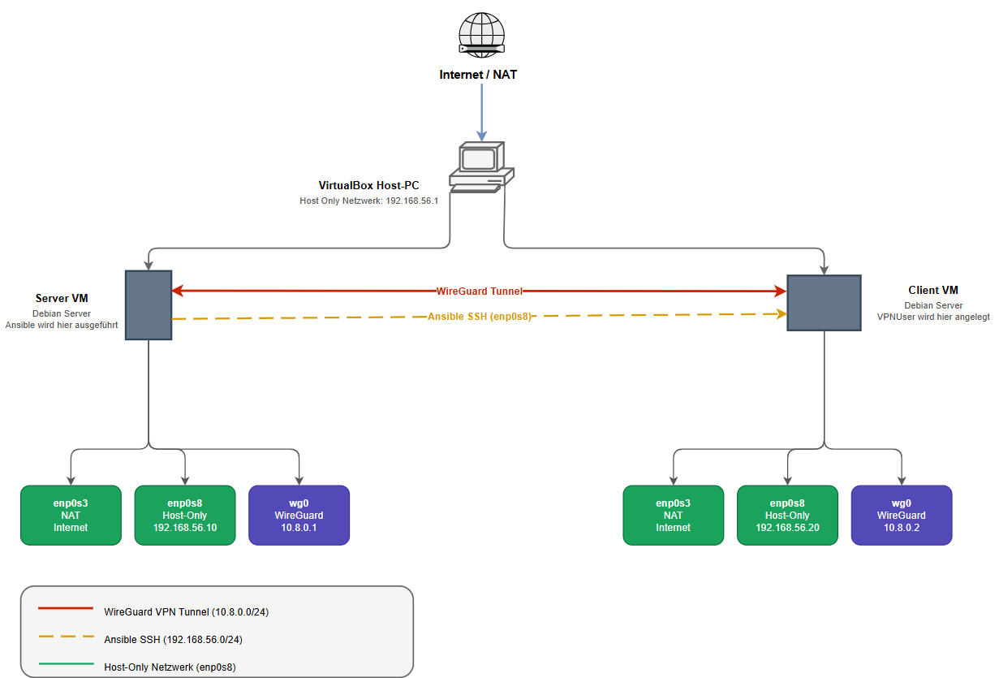

# WireGuard Ansible Automation
  
> Autoren: Manuel Sager & Yves Weber  
> Fach: Netzwerkbetriebssysteme – Dozent Oliver Büchel
 
---
 
## Was macht diese Ansible Automation?
 
Die folgende Erklärung ist für einen ersten Test auf einem Client Step-by Step ausgelegt. Erfahrene Benutzer müssen, wenn bspw. im Bridgemodus getstet wird oder bereits existierende VM's verwendet werden, nicht unbedingt den Schritten der Reihe nach folgen. 

Dieses Projekt automatisiert den vollständigen Aufbau eines **WireGuard VPN-Tunnels** zwischen einer Server VM und einer oder mehreren Client VMs. Das Ansible-Playbook wird auf der Server VM ausgeführt und konfiguriert alle Maschinen vollautomatisch.



Das Playbook läuft in **3 Phasen**:
 
**Phase 1 – WireGuard Server einrichten**
- WireGuard installieren
- Server-Keypair generieren (`server_private.key` / `server_public.key`)
- IP-Forwarding via `sysctl` aktivieren
- Server-Config (`wg0.conf`) über Jinja2-Template deployen
- WireGuard-Dienst starten und aktivieren

**Phase 2 – WireGuard Client einrichten**
- WireGuard auf der Client VM installieren
- VPN-User (`VPNUser`) anlegen
- Client-Keypair generieren
- Client-Config deployen
- WireGuard-Dienst starten und aktivieren

**Phase 3 – Peers eintragen**
- Client als Peer in die Server-Config eintragen (`blockinfile`, idempotent)
- WireGuard auf dem Server neu laden
---
 
## Voraussetzungen
 
- VirtualBox mit zwei Debian VMs
- Beide VMs haben zwei Netzwerkkarten:
  - **Adapter 1**: NAT enp0s3 (für Internet / apt)
  - **Adapter 2**: Host-Only Ethernet Adapter enp0s8 (für VM-zu-VM Kommunikation)
  - **Wichtig**: Diese Anleitung ist zum Testen auf einem Client vorgesehen. Falls in einem Netzwerk wie z.B. Teko Netz getestet werden soll, benötigt man nur eine Netzwerkkarte als Netzwerkbrücke und muss vor der konfiguration der .yaml Dateien mit dem Befehl "ip a" die IP Adresse rausschreiben um diese dann zu verwenden. Zudem kann man **Punkt 5** der Step by Step Anleitung überspringen.
- Ansible ist auf der Server VM installiert
- Git ist auf der Server VM installiert
- SSH Zugriff vom Server auf den Client mit Public Key.

---
 ## Step-by-Step Anleitung
 
### Schritt 1 – VirtualBox Host-Only Netzwerk einrichten
 
In VirtualBox: **Datei → Host-only Network Manager**
 
- Netzwerk → Erzeugen
- IPv4-Adresse: `192.168.56.1`
- Subnetzmaske: `255.255.255.0`
- **DHCP-Server deaktivieren** (wir nutzen statische IPs)
---

### Schritt 2 – Debian VMs erstellen
 
Für **beide VMs** (Server und Client) dieselben Schritte:
 
1. Neue VM → Typ: Linux, Debian 64-bit
2. RAM: mind. 1024 MB, Disk: 20 GB (dynamisch)
3. Debian ISO einlegen und installieren
4. Während der Installation: **kein Desktop** (nur Standard-System-Tools auswählen)
5. Root-Passwort setzen und einen normalen Benutzer anlegen (z.B. `TestUser`)
**Netzwerkadapter pro VM:**
 
| Adapter | Typ | Interface |
|---|---|---|
| Adapter 1 | NAT | enp0s3 |
| Adapter 2 | Host-Only    | enp0s8 |
 
---

### Schritt 3 – sudo einrichten (beide VMs)
 
Debian installiert `sudo` nicht automatisch. Als **root** einloggen:
 
```bash
su -
apt install -y sudo
usermod -aG sudo TestUser # Hier bei TestUser den Namen des Users eingeben
exit
```
 
Danach ausloggen und neu einloggen, damit die Gruppenänderung wirksam wird:
 
```bash
exit
# neu einloggen als z.B. TestUser
sudo whoami   # muss "root" ausgeben
```
 
---

### Schritt 4 – Interface-Namen prüfen (beide VMs)
 
```bash
ip a
```
 
Die Interface-Namen auf Debian können abweichen. Typische Namen:
 
| Interface | Zweck |
|---|---|
| `enp0s3` | NAT (Internet) |
| `enp0s8` | Host-Only (VM-Kommunikation) |
 
> Falls deine Interfaces anders heissen (z.B. `eth0`, `eth1`), die Namen notieren — du brauchst sie in Schritt 5 und 7.
 
---

### Schritt 5 – Statische IPs setzen (Debian: `/etc/network/interfaces`)
 
**Server VM:**
 
```bash
sudo nano /etc/network/interfaces
```
 
```
# Loopback
auto lo
iface lo inet loopback
 
# NAT – Internet
auto enp0s3
iface enp0s3 inet dhcp
 
# Host-Only – statische IP
auto enp0s8
iface enp0s8 inet static
    address 192.168.56.10
    netmask 255.255.255.0
```
 
Netzwerk neu starten:
 
```bash
sudo systemctl restart networking
ip a   # enp0s8 sollte 192.168.56.10 zeigen
```
 
**Client VM:**

```bash
sudo nano /etc/network/interfaces
```
 
```
# Loopback
auto lo
iface lo inet loopback
 
# NAT – Internet
auto enp0s3
iface enp0s3 inet dhcp
 
# Host-Only – statische IP
auto enp0s8
iface enp0s8 inet static
    address 192.168.56.20
    netmask 255.255.255.0
```
 
```bash
sudo systemctl restart networking
ip a   # enp0s8 sollte 192.168.56.20 zeigen
```
 
---

### Schritt 6 – Verbindung zwischen VMs testen
 
Von der **Server VM**:
 
```bash
ping 192.168.56.20
```
 
Von der **Client VM**:
 
```bash
ping 192.168.56.10
```
 
Beide Pings müssen durchkommen bevor du weitermachst.
 
---

### Schritt 7 – Ansible, Git und SSH auf der Server VM installieren
 
```bash
sudo apt update && sudo apt upgrade -y
sudo apt install -y ansible git openssh-client
ansible --version
```
 
---

### Schritt 8 – SSH-Server auf der Client VM installieren
 
```bash
sudo apt install -y openssh-server
sudo systemctl enable ssh
sudo systemctl start ssh
sudo systemctl status ssh   # muss "active (running)" zeigen
```
 
---

### Schritt 9 – SSH-Key generieren und auf Client VM kopieren
 
Auf der **Server VM**:
 
```bash
ssh-keygen -t ed25519 -C "wireguard-ansible"
# Enter drücken (kein Passphrase nötig)
```
 
SSH-Key auf die Client VM übertragen:
 
```bash
ssh-copy-id UserNameClient@192.168.56.20
# Passwort der Client VM eingeben
```
 
Verbindung testen:
 
```bash
ssh UserNameClient@192.168.56.20
# Kein Passwort = Erfolg
exit
```
 
---

### Schritt 10 – Repo klonen
 
Auf der **Server VM**:
 
```bash
git clone https://github.com/y95Weber/Wireguard-Ansible-Automation.git
cd Wireguard-Ansible-Automation
```
 
---

### Schritt 11 – `vars.yml` anpassen
 
```bash
nano vars.yml
```
 
```yaml
# vars.yml dient als zentrale Konfiguration, hier wird alles angepasst
 
# WireGuard Server (Admin-VM)
wg_server_ip: "192.168.56.10"      # IP der Server VM im Host-Only Netz (in diesem Beispiel enp0s8. Falls nur Netzwerkbrücke werwendet wird ist es enp0s3)
wg_server_port: 51820
wg_subnet: "10.8.0.0/24"
wg_server_vpn_ip: "10.8.0.1"
 
# Netzwerk-Interface auf den VMs (für SSH/Ansible)
ansible_interface: "enp0s8"        # Interface des Host-Only Adapters → mit "ip a" prüfen (in diesem Beispiel enp0s8. Falls nur Netzwerkbrücke werwendet wird ist es enp0s3)
 
# VPN-User Konfiguration
vpn_user: "VPNUser"
 
# Pfade
wg_dir: "/etc/wireguard"
```
 
> **Wichtig:** `ansible_interface` muss dem Interface entsprechen, das die IP `192.168.56.10` hat. Mit `ip a` auf der Server VM prüfen.
 
---

### Schritt 12 – `inventory.ini` anpassen
 
```bash
nano inventory.ini
```
 
```ini
# inventory.ini definiert die Hosts und Gruppen für Ansible
 
[wg_server]
admin-vm ansible_connection=local ansible_host=192.168.56.10
 
[wg_clients]
vm1   ansible_host=192.168.56.20 ansible_user=HierUserName wg_vpn_ip=10.8.0.2
 
[all:vars]
ansible_python_interpreter=/usr/bin/python3
```
 
> **Wichtig:** `ansible_user` muss dem tatsächlichen Benutzernamen auf der Client VM entsprechen.  
> Für jede weitere Client VM eine neue Zeile hinzufügen und `wg_vpn_ip` erhöhen (z.B. `10.8.0.3`).
 
---

### Schritt 13 – Syntax-Check
 
```bash
ansible-playbook -i inventory.ini playbook.yml --syntax-check
```
 
Erwartete Ausgabe:
```
playbook: playbook.yml
```
 
---

### Schritt 14 – Playbook ausführen
 
```bash
ansible-playbook -i inventory.ini playbook.yml --ask-become-pass
```
 
sudo-Passwort der Server VM eingeben. Das Playbook konfiguriert nun beide VMs automatisch.
 
Erwartete Ausgabe im PLAY RECAP:
```
admin-vm   : ok=12  changed=5  unreachable=0  failed=0
vm1        : ok=9   changed=3  unreachable=0  failed=0
```
 
---

### Schritt 15 – Verbindung testen

**VPNUser PW setzen** 
```bash
# Auf der Client VM 

sudo passwd VPNUser
> neues Passwort eingeben und bestätigen.
su VPNUser
```
 
**WireGuard Status prüfen:**
```bash
sudo wg show
```
 
**Ping über VPN-Tunnel:**
```bash
ping 10.8.0.2
```
 
**SSH als VPNUser über den Tunnel**
```bash
ssh VPNUser@10.8.0.2
```
 
---

## Weitereintwicklungsmöglichkeiten 

- Das Playbook so erweitern, dass wenn bereits ein wg0 interface existiert, dieses heruntergefahren, gelöscht wird und anschliessend das neue hochgefahren. 
- 
